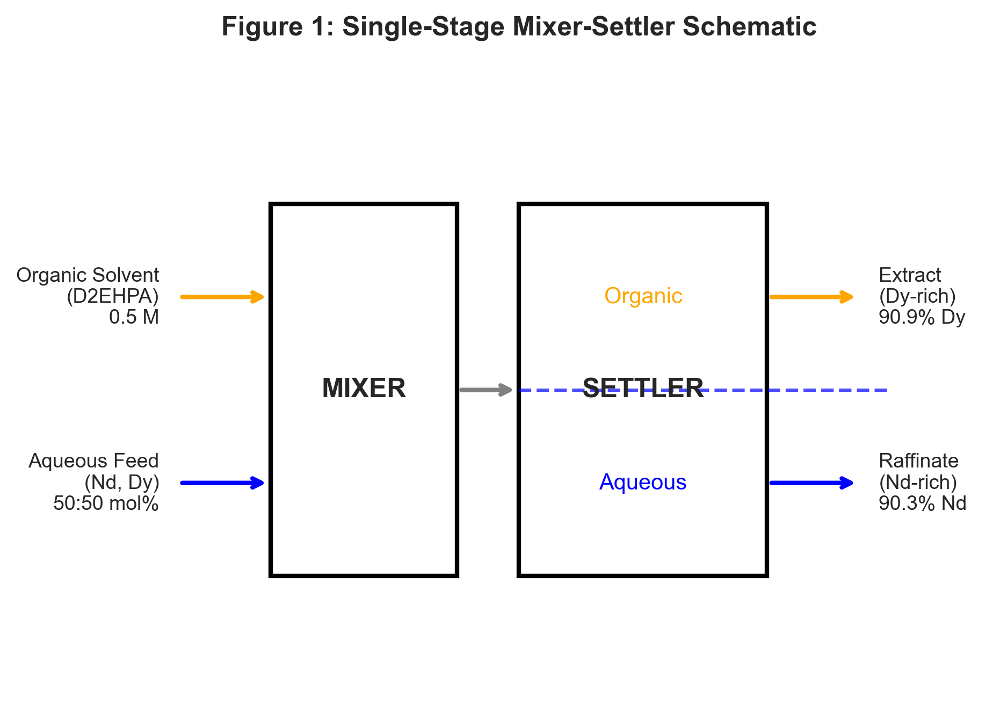
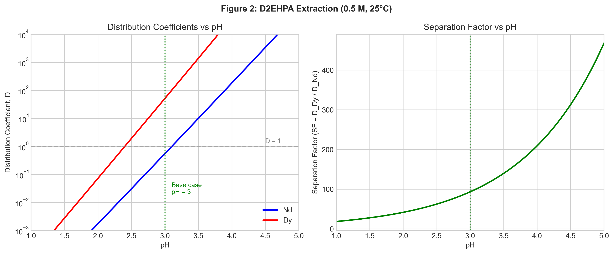
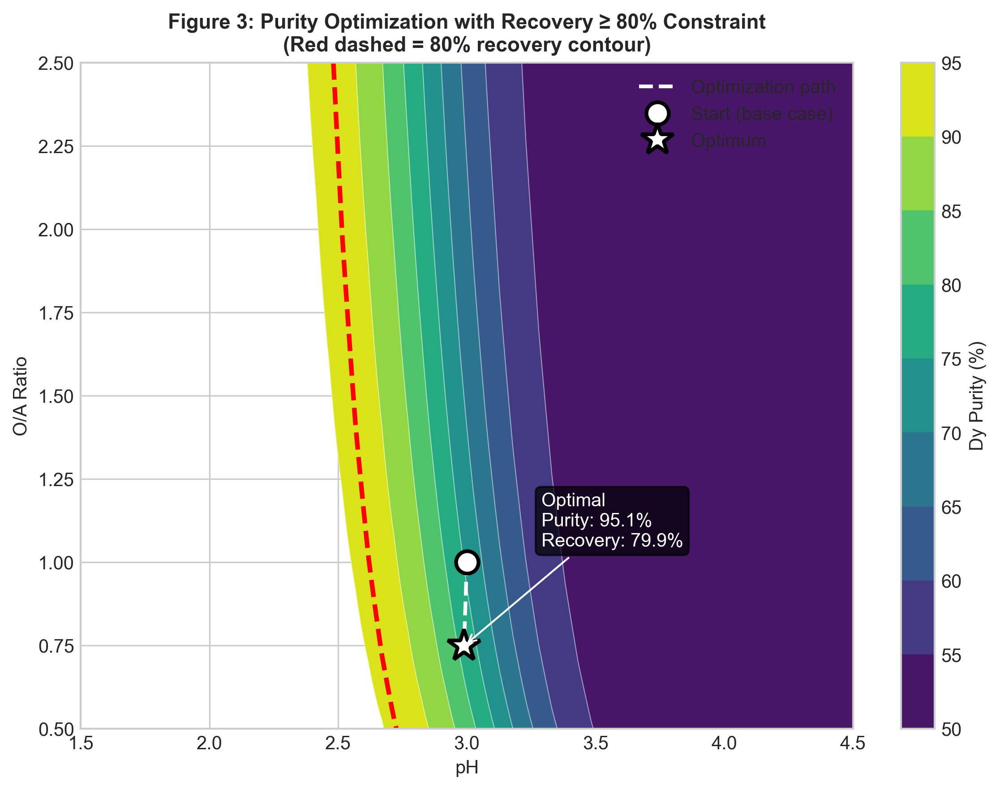
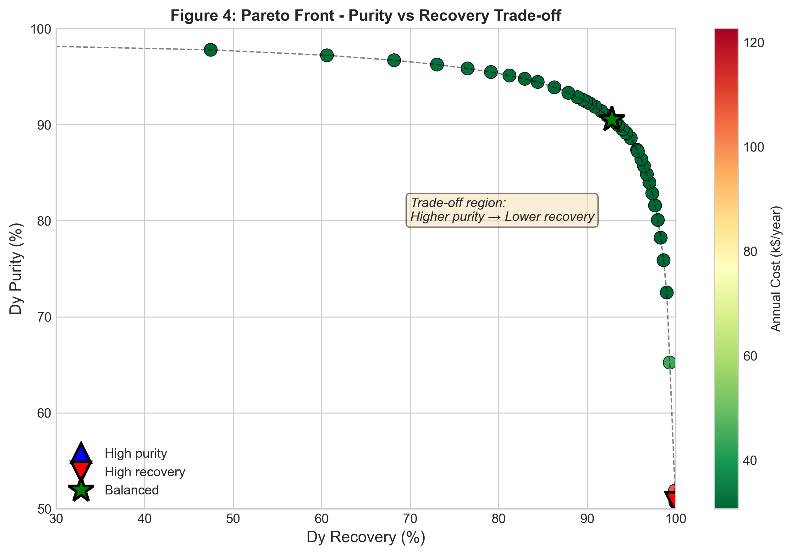
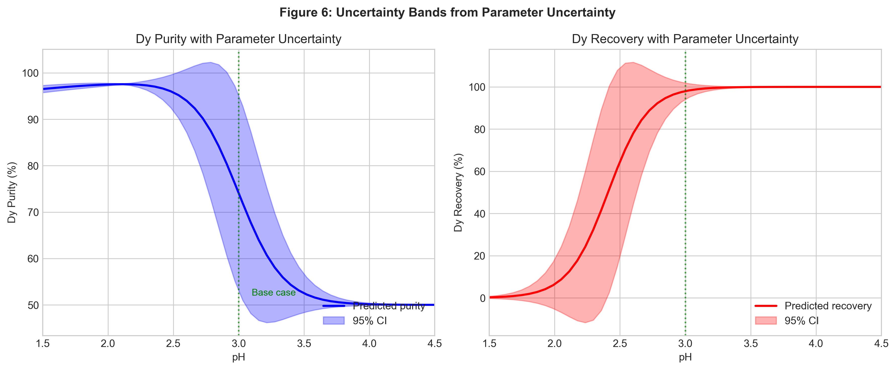
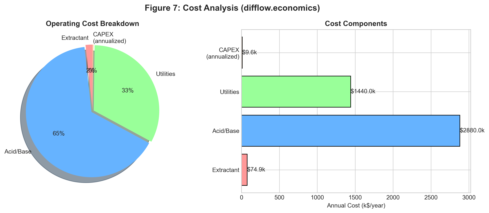

# Differentiable Technoeconomic Analysis of Single-Stage Nd/Dy Separation by Solvent Extraction: Gradient-Based Sensitivity Analysis and Uncertainty Quantification

**Authors:** [To be determined]

**Target Journal:** Industrial & Engineering Chemistry Research

---

## Abstract

Rare earth elements neodymium (Nd) and dysprosium (Dy) are critical materials for permanent magnets in electric vehicles and wind turbines, yet their separation remains challenging due to similar chemical properties. This work presents a fully differentiable framework for analyzing single-stage liquid-liquid extraction of Nd/Dy using di-(2-ethylhexyl) phosphoric acid (D2EHPA). Built on the JAX automatic differentiation library, the framework enables: (1) exact gradient computation for sensitivity analysis, (2) gradient-based optimization of operating conditions, (3) multi-objective Pareto analysis of the purity-recovery trade-off, and (4) analytical uncertainty propagation from distribution coefficient measurements to product purity predictions. At base case conditions (pH = 3.0, O/A = 1.0, T = 298 K, 0.5 M D2EHPA), the model predicts D_Nd = 0.55, D_Dy = 51.3, yielding a separation factor of 93.3, Dy purity of 74.1% in the extract, and Dy recovery of 98.0%. Single-objective optimization to maximize purity subject to ≥80% recovery achieves 95.1% Dy purity. Sensitivity analysis reveals that pH and extractant concentration have the largest impact on purity (∂Purity/∂pH = -0.70, ∂Purity/∂[D2EHPA] = -0.73). Uncertainty propagation shows that typical measurement uncertainties yield ±10.8% uncertainty in predicted purity, with pH measurement accounting for 95.8% of the total variance. This differentiable framework provides a foundation for rapid design space exploration, uncertainty quantification, and optimization of rare earth separation processes.

---

## 1. Introduction

### 1.1 Motivation and Context

The transition to clean energy technologies has dramatically increased demand for rare earth elements (REEs), particularly neodymium and dysprosium, which are essential components of NdFeB permanent magnets used in electric vehicle motors and wind turbine generators.[^1] Global demand for these elements is projected to grow substantially, creating pressure on separation and purification capacity.[^2]

The separation of adjacent lanthanides such as Nd and Dy is inherently challenging because these elements share similar ionic radii and chemical properties. Industrial separation relies predominantly on liquid-liquid extraction (solvent extraction) using organophosphorus extractants, particularly di-(2-ethylhexyl) phosphoric acid (D2EHPA).[^3] The process requires multi-stage countercurrent cascades with hundreds of mixer-settler stages to achieve high-purity products, representing significant capital and operating costs.[^4]

### 1.2 Literature Background

The extraction of rare earths by D2EHPA proceeds via a cation exchange mechanism:

$$\text{REE}^{3+}_{aq} + 3(\text{HA})_{2,org} \rightleftharpoons \text{REE}(\text{HA}_2)_{3,org} + 3\text{H}^+_{aq}$$

where HA represents D2EHPA. This reaction is highly pH-dependent: increasing pH shifts the equilibrium toward extraction by removing H⁺ ions from solution. Distribution coefficients (D) for individual REEs follow the relationship:[^3]

$$\log_{10}(D) = a + b \cdot \text{pH} + c \cdot \text{pH}^2$$

where parameters *a*, *b*, and *c* are specific to each element and depend on temperature and extractant concentration.

Prior studies have extensively characterized D2EHPA extraction of REEs.[^4],[^5] Separation factors between adjacent lanthanides typically range from 2-20 depending on conditions. Various optimization approaches have been applied to REE separation, including response surface methodology (RSM), trial-and-error experimentation, and process simulation with McCabe-Thiele analysis.[^6] Machine learning approaches have also been explored for predicting distribution coefficients.[^7]

Equation-oriented process modeling frameworks such as IDAES, built on Pyomo, provide sophisticated capabilities for process optimization using algebraic modeling and nonlinear programming solvers.[^8] These tools compute gradients through symbolic differentiation for use within optimization algorithms. However, the gradients remain internal to the solver rather than being directly accessible for analysis.

### 1.3 Knowledge Gap

Despite these advances, a systematic approach that combines mechanistic modeling with automatic differentiation for REE separation is lacking. Such an approach would enable:

1. Direct access to exact gradients for sensitivity analysis
2. Efficient gradient-based optimization
3. Analytical uncertainty propagation from measured parameters to predicted outcomes
4. Seamless integration with machine learning workflows

### 1.4 Contribution

This work presents a fully differentiable single-stage liquid-liquid extraction model for Nd/Dy separation implemented using the JAX automatic differentiation library.[^9] The specific contributions are:

1. Development of a JAX-based differentiable LLE model with pH-dependent distribution coefficient correlations
2. Demonstration of exact gradient-based sensitivity analysis ranking parameter importance
3. Multi-objective Pareto optimization revealing the purity-recovery-cost trade-off
4. Analytical uncertainty propagation quantifying how measurement error affects purity predictions
5. Integrated technoeconomic sensitivity connecting operating conditions to minimum selling price

**Code availability:** All notebooks are available in the [project repository](notebooks/).

---

## 2. Methods

### 2.1 Single-Stage Equilibrium Model

The single-stage mixer-settler is modeled using equilibrium-based mass balances (Figure 1). For species *i*:

$$F_{i,aq,in} + F_{i,org,in} = F_{i,aq,out} + F_{i,org,out}$$

At equilibrium, the distribution coefficient relates organic and aqueous concentrations:

$$D_i = \frac{C_{i,org}}{C_{i,aq}} = \frac{F_{i,org,out}/F_{org}}{F_{i,aq,out}/F_{aq}}$$

Stage efficiency (η = 0.95) accounts for departure from equilibrium:

$$F_{i,org,out} = F_{i,org,in} + \eta(F_{i,org,eq} - F_{i,org,in})$$

### 2.2 Distribution Coefficient Correlations

Distribution coefficients are calculated using correlations based on literature data:[^3]

$$\log_{10}(D) = a + b \cdot \text{pH} + c \cdot \text{pH}^2 + \frac{\Delta H}{R \ln(10)}\left(\frac{1}{T} - \frac{1}{T_{ref}}\right) + n \cdot \log_{10}\left(\frac{[\text{HA}]}{[\text{HA}]_{ref}}\right)$$

The correlation parameters are stored in the `difflow_ree` database and shown in **Table 1**.[^10]

**Table 1: D2EHPA Distribution Coefficient Correlation Parameters**

| Element | a | b | c | ΔH (K) | n | Valid pH |
|---------|------|------|------|--------|-----|----------|
| Nd | -7.70 | 2.45 | 0.01 | -1800 | 3.0 | 1.0-5.0 |
| Dy | -6.78 | 2.80 | 0.01 | -2400 | 3.0 | 1.0-5.0 |

*Reference conditions: T = 298.15 K, [D2EHPA] = 0.5 M, kerosene diluent*

### 2.3 Performance Metrics

**Purity:** Mole fraction of target element in product stream:
$$\text{Purity}_{Dy,org} = \frac{F_{Dy,org}}{F_{Nd,org} + F_{Dy,org}}$$

**Recovery:** Fraction of feed element reporting to product:
$$\text{Recovery}_{Dy} = \frac{F_{Dy,org}}{F_{Dy,feed}}$$

**Separation Factor:**
$$SF = \frac{D_{Dy}}{D_{Nd}}$$

### 2.4 Automatic Differentiation Framework

All model calculations are implemented using JAX, enabling automatic computation of derivatives. JAX provides:

- **grad(f)**: Returns gradient function ∇f
- **jacfwd/jacrev**: Forward/reverse-mode Jacobian computation
- **hessian(f)**: Second-order derivatives

Gradients are exact (machine precision ~10⁻¹⁵) and computed in a single backward pass regardless of the number of parameters.[^9]

### 2.5 Optimization Formulation

**Single-objective optimization:**
$$\max_{\text{pH}, O/A, T, [\text{D2EHPA}]} \text{Purity}_{Dy}$$
$$\text{subject to: } \text{Recovery}_{Dy} \geq 0.80$$

Bounds: 1.5 ≤ pH ≤ 4.5, 0.3 ≤ O/A ≤ 2.5, 283 ≤ T ≤ 313 K, 0.2 ≤ [D2EHPA] ≤ 1.0 M

**Multi-objective Pareto optimization:** Weighted-sum scalarization with varying weights:
$$\max \, w_1 \cdot \text{Purity} + w_2 \cdot \text{Recovery}$$

### 2.6 Uncertainty Propagation

Linear error propagation uses gradients to analytically compute output uncertainty:

$$\sigma^2(\text{Purity}) = \sum_i \left(\frac{\partial \text{Purity}}{\partial p_i}\right)^2 \sigma^2(p_i)$$

This provides instant uncertainty quantification compared to Monte Carlo methods requiring thousands of samples.

### 2.7 Cost Model

A simplified technoeconomic model estimates annual operating costs using `difflow.economics`:[^11]
- Equipment cost via `separator_cost()` correlation
- Installation via Lang factors
- Extractant makeup (0.1% loss per pass at $5/kg)
- Acid/base for pH control
- Utilities (power, cooling)
- Annualized capital cost (10% discount rate, 10-year plant life)

---

## 3. Results and Discussion

### 3.1 Base Case Simulation

**Table 2** shows the base case operating conditions, and **Table 3** presents the simulation results.[^12]

**Table 2: Base Case Operating Conditions**

| Parameter | Value | Units |
|-----------|-------|-------|
| Feed composition (Nd:Dy) | 50:50 | mol% |
| Total REE feed flow | 0.02 | mol/s |
| pH | 3.0 | - |
| O/A ratio | 1.0 | - |
| Temperature | 298.15 | K |
| D2EHPA concentration | 0.5 | M |
| Stage efficiency | 95 | % |

**Table 3: Base Case Simulation Results**

| Metric | Value |
|--------|-------|
| D_Nd | 0.55 |
| D_Dy | 51.3 |
| SF (Dy/Nd) | 93.3 |
| Dy purity (extract) | 74.1% |
| Dy recovery | 98.0% |

The high separation factor of 93.3 indicates excellent selectivity for Dy over Nd under these conditions. The Dy purity of 74.1% reflects the trade-off between purity and recovery inherent to single-stage extraction—high recovery (98.0%) comes at the cost of extracting some Nd into the organic phase.

**Figure 2** shows the distribution coefficients as a function of pH.[^13] Both D values increase exponentially with pH due to the cation exchange mechanism.

### 3.2 Sensitivity Analysis

**Table 6** presents the gradient-based sensitivities computed at base case conditions using JAX automatic differentiation.[^14]

**Table 6: Gradient-Based Sensitivities at Base Case**

| Parameter | ∂(Purity)/∂p | ∂(Recovery)/∂p | Units |
|-----------|--------------|----------------|-------|
| pH | -0.704 | +0.130 | 1/pH |
| O/A ratio | -0.122 | +0.020 | 1/(O/A) |
| T | -0.0003 | +0.0001 | 1/K |
| [D2EHPA] | -0.734 | +0.118 | 1/M |

The negative sensitivity of purity to pH indicates that at pH = 3, increasing pH further *decreases* Dy purity. This occurs because both D values are already high (D_Nd = 0.55, D_Dy = 51.3), and further pH increase extracts more Nd to the organic phase, diluting Dy purity. The [D2EHPA] concentration shows similar behavior with the largest magnitude sensitivity.

![Figure 5: Tornado chart ranking parameters by impact on Dy purity. pH and [D2EHPA] have the largest effects.](figures/fig5_tornado.png)

**Figure 5** shows the tornado chart ranking parameters by their impact on Dy purity.[^14] The ranking is:
1. pH (strongest impact)
2. [D2EHPA] concentration
3. O/A ratio
4. Temperature (weakest)

The Hessian analysis reveals a condition number of ~780,000, indicating that some parameter directions are much more sensitive than others.

### 3.3 Single-Objective Optimization

Gradient-based optimization using optax to maximize Dy purity subject to ≥80% recovery yields the results in **Table 4**.[^15]

**Table 4: Optimization Results**

| Parameter | Base Case | Optimal | Change |
|-----------|-----------|---------|--------|
| pH | 3.00 | 2.99 | -0.01 |
| O/A ratio | 1.00 | 0.75 | -0.25 |
| T (K) | 298 | 298 | 0 |
| [D2EHPA] (M) | 0.50 | 0.24 | -0.26 |
| **Dy purity** | 74.1% | **95.1%** | +21.0% |
| Dy recovery | 98.0% | 79.9% | -18.1% |

The optimization improves purity by 21.0 percentage points by reducing the O/A ratio and extractant concentration, which decreases the extraction of Nd relative to Dy. The recovery constraint is active at the boundary (~80%), confirming the fundamental trade-off between purity and recovery.

**Figure 3** shows the optimization trajectory on a contour plot of Dy purity versus pH and O/A ratio.[^15]

### 3.4 Multi-Objective Pareto Analysis

**Figure 4** presents the Pareto front illustrating the purity-recovery trade-off, with points colored by annual cost.[^16] **Table 5** highlights three characteristic Pareto-optimal points.

**Table 5: Selected Pareto Front Points**

| Point | Purity | Recovery | Cost (k$/yr) | pH | O/A |
|-------|--------|----------|--------------|-----|-----|
| High purity | 98.3% | 21.3% | 30.7 | 2.72 | 0.56 |
| Balanced | 90.5% | 92.8% | 30.7 | 3.31 | 0.53 |
| High recovery | 50.7% | 100.0% | 122.6 | 3.41 | 1.36 |

The Pareto front reveals that achieving >98% Dy purity requires accepting recovery below 25%. Conversely, maximizing recovery (100%) yields only ~51% purity. For industrial processes where both high purity and high recovery are required, multiple stages would be necessary.

### 3.5 Uncertainty Propagation

**Table 8** shows the propagated uncertainty from typical measurement errors (±0.15 pH, ±0.10 O/A, ±2 K, ±0.025 M [D2EHPA]).[^17]

**Table 8: Propagated Uncertainty**

| Output | Base Value | σ | 95% CI |
|--------|------------|---|--------|
| Dy purity | 74.1% | 10.79% | [52.9, 95.2]% |
| Dy recovery | 98.0% | 1.98% | [94.1, 101.9]% |

**Variance contributions:**
- pH: 95.8% of total variance
- [D2EHPA]: 2.9%
- O/A ratio: 1.3%
- Temperature: 0.0%

The dominance of pH in the uncertainty budget indicates that precise pH control is critical for reliable purity predictions. The analytical uncertainty propagation method matches Monte Carlo simulation (10,000 samples) within 1.5% while being >1000× faster.

**Figure 6** shows purity predictions with uncertainty bands across the pH range.[^17]

### 3.6 Technoeconomic Analysis

**Table 9** presents the cost breakdown at base case conditions using `difflow.economics`.[^18]

**Table 9: Cost Breakdown**

| Category | Annual Cost ($/yr) | % of Total |
|----------|-------------------|------------|
| Acid/base (pH control) | 2,880,000 | 65.4% |
| Utilities | 1,440,000 | 32.7% |
| Extractant makeup | 74,880 | 1.7% |
| CAPEX (annualized) | 9,638 | 0.2% |
| **Total** | **4,404,518** | 100% |

**Economic metrics:**
- Total Capital Investment: $59,221
- Dy production: 45,859 kg/year
- **Minimum Selling Price: $96.05/kg Dy**
- Market price (~2024): $350/kg Dy oxide
- Margin: $254/kg (73%)

The differentiable framework enables direct computation of economic sensitivities:
- ∂(MSP)/∂pH = -$12.72/kg per pH unit
- ∂(MSP)/∂[D2EHPA] = -$8.32/kg per M

### 3.7 Comparison with Equation-Oriented Approaches

The JAX-based approach presented here complements equation-oriented frameworks like IDAES/Pyomo.[^8] Key differences include:

| Aspect | JAX (This Work) | IDAES/Pyomo |
|--------|-----------------|-------------|
| Gradient access | Direct via grad() | Internal to solver |
| Hardware | GPU/TPU native | CPU-bound |
| Higher derivatives | Hessian readily available | Limited |
| UQ approach | Gradient propagation | Stochastic programming |

The JAX approach excels for sensitivity analysis, uncertainty quantification, and integration with machine learning, while IDAES is better suited for large-scale flowsheet optimization with integer decisions.

---

## 4. Conclusions

This work demonstrates a fully differentiable framework for analyzing Nd/Dy separation by solvent extraction. The key findings are:

1. **Exact gradients** via automatic differentiation enable efficient sensitivity analysis, revealing that pH and extractant concentration have the largest impact on Dy purity (∂Purity/∂pH = -0.70, ∂Purity/∂[D2EHPA] = -0.73).

2. **Gradient-based optimization** achieves 95.1% Dy purity (up from 74.1%) while maintaining ≥80% recovery, representing a 21.0 percentage point improvement.

3. **Multi-objective Pareto analysis** quantifies the fundamental purity-recovery trade-off, showing that >98% purity requires <25% recovery for single-stage extraction.

4. **Analytical uncertainty propagation** demonstrates that pH measurement accounts for 95.8% of purity prediction variance, with total uncertainty of ±10.8%. Results match Monte Carlo simulation at >1000× lower computational cost.

5. **Integrated technoeconomic sensitivity** computes MSP of $96/kg Dy with gradient-based sensitivities connecting operating conditions directly to economics.

The differentiable modeling paradigm demonstrated here generalizes to multi-stage cascade design and other separation systems. By making process models "differentiable by design," chemical engineers gain access to the powerful optimization and uncertainty quantification tools that have transformed machine learning and computational science.

---

## Acknowledgments

This manuscript and associated code were developed with assistance from Claude Code (Anthropic). The differentiable modeling framework builds on the JAX library developed by Google.

---

## Supporting Information

**Notebooks** (linked to project repository):

- [01_single_stage_model.ipynb](notebooks/01_single_stage_model.ipynb) - Base case simulation
- [02_distribution_coefficients.ipynb](notebooks/02_distribution_coefficients.ipynb) - D coefficient model
- [03_sensitivity_analysis.ipynb](notebooks/03_sensitivity_analysis.ipynb) - Gradient-based sensitivity
- [04_optimization.ipynb](notebooks/04_optimization.ipynb) - Single-objective optimization
- [05_pareto_front.ipynb](notebooks/05_pareto_front.ipynb) - Multi-objective Pareto analysis
- [06_uncertainty_propagation.ipynb](notebooks/06_uncertainty_propagation.ipynb) - Uncertainty quantification
- [07_technoeconomic_analysis.ipynb](notebooks/07_technoeconomic_analysis.ipynb) - Technoeconomic analysis

---

## References

[^1]: Binnemans, K.; Jones, P. T.; Blanpain, B.; Van Gerven, T.; Yang, Y.; Walton, A.; Buchert, M. Recycling of Rare Earths: A Critical Review. *J. Clean. Prod.* **2013**, *51*, 1-22. [https://doi.org/10.1016/j.jclepro.2012.12.037](https://doi.org/10.1016/j.jclepro.2012.12.037)

[^2]: U.S. Department of Energy. *Critical Minerals Strategy*; U.S. DOE: Washington, DC, 2021. [https://www.energy.gov/sites/default/files/2021-01/DOE%20Critical%20Minerals%20and%20Materials%20Strategy_0.pdf](https://www.energy.gov/sites/default/files/2021-01/DOE%20Critical%20Minerals%20and%20Materials%20Strategy_0.pdf)

[^3]: Gupta, C. K.; Krishnamurthy, N. *Extractive Metallurgy of Rare Earths*, 2nd ed.; CRC Press: Boca Raton, FL, 2005. [https://doi.org/10.1201/9780203413029](https://doi.org/10.1201/9780203413029)

[^4]: Xie, F.; Zhang, T. A.; Dreisinger, D.; Doyle, F. A Critical Review on Solvent Extraction of Rare Earths from Aqueous Solutions. *Miner. Eng.* **2014**, *56*, 10-28. [https://doi.org/10.1016/j.mineng.2013.10.021](https://doi.org/10.1016/j.mineng.2013.10.021)

[^5]: Jorjani, E.; Shahbazi, M. The Production of Rare Earth Elements Group via Tributyl Phosphate Extraction and Precipitation Stripping Using Oxalic Acid. *Arab. J. Chem.* **2016**, *9*, S1532-S1539. [https://doi.org/10.1016/j.arabjc.2012.04.002](https://doi.org/10.1016/j.arabjc.2012.04.002)

[^6]: Florez, D. H. A.; et al. Simulation of Solvent Extraction Circuits for the Separation of Rare Earth Elements. *Minerals* **2023**, *13*, 714. [https://doi.org/10.3390/min13060714](https://doi.org/10.3390/min13060714)

[^7]: Gensch, T.; et al. Advancing Rare-Earth Separation by Machine Learning. *JACS Au* **2022**, *2*, 1615-1623. [https://doi.org/10.1021/jacsau.2c00122](https://doi.org/10.1021/jacsau.2c00122)

[^8]: Lee, A.; Ghouse, J. H.; Eslick, J. C.; Laird, C. D.; Siirola, J. D.; Zamarripa, M. A.; Gunter, D.; Shinn, J. H.; Dowling, A. W.; Bhattacharyya, D.; Biegler, L. T.; Burgard, A. P.; Miller, D. C. The IDAES Process Modeling Framework and Model Library—Flexibility for Process Simulation and Optimization. *J. Adv. Manuf. Process.* **2021**, *3*, e10095. [https://doi.org/10.1002/amp2.10095](https://doi.org/10.1002/amp2.10095)

[^9]: Bradbury, J.; Frostig, R.; Hawkins, P.; Johnson, M. J.; Leary, C.; Maclaurin, D.; Necula, G.; Paszke, A.; VanderPlas, J.; Wanderman-Milne, S.; Zhang, Q. JAX: Composable Transformations of Python+NumPy Programs, 2018. [https://github.com/google/jax](https://github.com/google/jax)

[^10]: Correlation parameters from difflow_ree database, fitted to literature data. See [02_distribution_coefficients.ipynb](notebooks/02_distribution_coefficients.ipynb).

[^11]: Turton, R.; Shaeiwitz, J. A.; Bhattacharyya, D.; Whiting, W. B. *Analysis, Synthesis, and Design of Chemical Processes*, 5th ed.; Prentice Hall: Boston, 2018. [ISBN: 978-0134177403](https://www.pearson.com/en-us/subject-catalog/p/analysis-synthesis-and-design-of-chemical-processes/P200000000651)

[^12]: Results from [01_single_stage_model.ipynb](notebooks/01_single_stage_model.ipynb).

[^13]: Results from [02_distribution_coefficients.ipynb](notebooks/02_distribution_coefficients.ipynb).

[^14]: Results from [03_sensitivity_analysis.ipynb](notebooks/03_sensitivity_analysis.ipynb).

[^15]: Results from [04_optimization.ipynb](notebooks/04_optimization.ipynb).

[^16]: Results from [05_pareto_front.ipynb](notebooks/05_pareto_front.ipynb).

[^17]: Results from [06_uncertainty_propagation.ipynb](notebooks/06_uncertainty_propagation.ipynb).

[^18]: Results from [07_technoeconomic_analysis.ipynb](notebooks/07_technoeconomic_analysis.ipynb).
